# dbt-graph-theory

[](https://github.com/jpmmcneill/dbt-graph-theory/actions)

[](https://github.com/dbt-labs/dbt-core)
[](https://github.com/dbt-labs/dbt-utils/)

A DBT package designed to help SQL based analysis of graphs.

Supported adapters are: 
- `dbt-snowflake`
- `dbt-postgres` (note postgres versions >= 10 is requried)
- `dbt-bigquery` (see important note below!!!)

Adapter contributions are welcome! Generally new adapters require additions to the `macros/utils` folder, assuming the given database / engine supports recursive CTEs elegantly. In some cases (namely bigquery), specific array handling was required.

It's recommended to use the unit test suit to develop new adapters. Please get in touch if you need assistance!

**IMPORTANT NOTE**:
BigQuery is untested in the wild, and is quite brittle regarding the `recursive` keyword. Ensure you __only__ macros without CTE nesting - for example, to use `largest_connected_subgraphs`, write SQL like:

```sql
-- model.sql
{{
  largest_connected_subgraphs(...)
}}
```

rather than

```sql
-- model.sql
with recursive foo as (
  {{
    largest_connected_subgraphs(...)
  }}
)
...
```

This is to ensure that the `recursive` handling works. A feature request to improve this behaviour has been sent to google - please upvote:
https://issuetracker.google.com/u/1/issues/263510050

----
## Install

`dbt-graph-theory` currently supports `dbt 1.0.0` or higher.

Check [dbt package hub](https://hub.getdbt.com/jpmmcneill/dbt-graph-theory/latest/) for the latest installation instructions, or [read the docs](https://docs.getdbt.com/docs/package-management) for more information on installing packages.

Include in `packages.yml`

```yaml
packages:
  - package: jpmmcneill/dbt_graph_theory
    version: [">=0.1.0", "<0.2.0"]
    # <see https://github.com/jpmmcneill/dbt-graph-theory/releases/latest> for the latest version tag
```

For latest release, see [https://github.com/jpmmcneill/dbt-graph-theory/releases](https://github.com/jpmmcneill/dbt-graph-theory/releases)


----
## Introduction

A [graph](https://en.wikipedia.org/wiki/Graph_(discrete_mathematics)) is a structure defined by a set of vertices and edges.

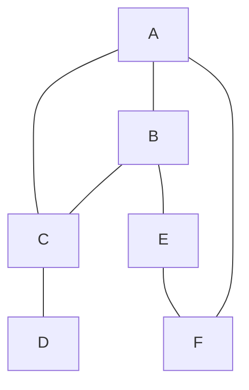

The above is a graph with vertices {A, B, C, D, E, F}, and edges described by the lines between vertices. In the context of this package, this graph is represented by the SQL table:

| edge_id | vertex_1 | vertex_2 |
|:-------:|:--------:|:--------:|
|    1    |     A    |     B    |
|    2    |     A    |     C    |
|    3    |     B    |     C    |
|    4    |     C    |     D    |
|    5    |     B    |     E    |
|    6    |     E    |     F    |
|    7    |     A    |     F    |

In table representation, null vertices represent vertices that are not connected to any other vertices.

The following tables:

| edge_id | vertex_1 | vertex_2 |
|:-------:|:--------:|:--------:|
|    1    |     A    |          |
|    2    |     B    |     C    |

| edge_id | vertex_1 | vertex_2 |
|:-------:|:--------:|:--------:|
|    1    |          |     A    |
|    2    |     B    |     C    |

are equivalent to:

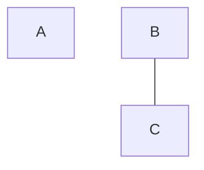

In this package, all rows are considered - meaning that the following tables are equivalent:

| edge_id | vertex_1 | vertex_2 |
|:-------:|:--------:|:--------:|
|    1    |          |     A    |
|    2    |     A    |          |
|    3    |          |          |
|    4    |     A    |     B    |

| edge_id | vertex_1 | vertex_2 |
|:-------:|:--------:|:--------:|
|    1    |     A    |     B    |

This package also supports multiple graphs being represented in the same table:

| graph_id | edge_id | vertex_1 | vertex_2 |
|:--------:|:-------:|:--------:|:--------:|
|     1    |    1    |     A    |     B    |
|     1    |    2    |     A    |     C    |
|     1    |    3    |     B    |     C    |
|     1    |    4    |     C    |     D    |
|     2    |    1    |    A'    |    B'    |
|     2    |    2    |    B'    |    C'    |
|     2    |    3    |    C'    |    D'    |

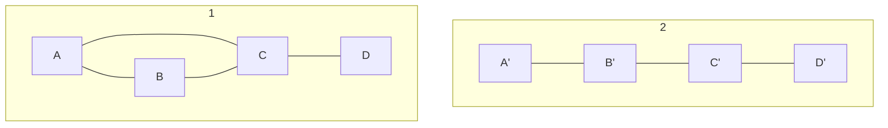

While in the example above no vertex labels were shared between different `graph_id`s, this is not a strict requirement. When a vertex is shared between two `graph_id`s, the vertices are considered seperate (ie. all algorithms are performed on the graph_id level).

`edge_id` should be unique over the table (when `graph_id` is not defined) or at a `graph_id` level when `graph_id` is defined.

### Types of Graph

This package currently two types of graphs: Ordered Graphs and Non Ordered Graphs.
There currently no _in data_ difference between these graphs (ie. a given graph table can correspond to both types), but some macros are designed to be implemented on specific types of graph. For example, `connect_ordered_graph` is designed to only be used with ordered graphs.

#### Ordered Graphs

Ordered graphs have a natural order to their nodes. In this package, the ordering is typically implemented via edges - meaning that this package treats ordered graphs as an extension of induced ordered graphs. For more detail, see [wikipedia](https://en.wikipedia.org/wiki/Ordered_graph). Ordered graphs are typically interacted with via an `ordering` field - this corresponds to the order of the edges / nodes. Supported Ordering types are numeric and date(time).

An example of an ordered graph might be a rename path, or a customer's subscription history. These would both be ordered via a timestamp at which the rename happened / the customer swapped subscription type (respectively). 

#### Non Ordered Graphs

Non ordered graphs are simply graphs that do not fall into the above definition.


----
## Variables

This package currently has no variables that need to be configured.

----
## Integration Tests (Developers Only)

This section assumes development on a mac, where python3 & postgresql are installed.

At the moment, only postgres integration tests are implemented.

### Setting up python environment 

Integration tests for this repository are managed via the `integration_tests` folder.

To set up a python3 virtual environment, run the following in order from the `integration_tests` folder.

```
python3 -m venv ci_venv
source ci_venv/bin/activate
pip install -r requirements/requirements_<adapter>.txt
```

ie. to use postgres, run `pip install -r requirements/requirements_postgres.txt

To exit the virtual environment, simply run:

```
deactivate
```

By default, dbt runs against postgres on setup. You can use any of the adapters listed (the best way of seeing these is by the requirements files).
Each adapter has a specific target in the ci_profiles.yml. You can specifc these with the `--target` flag in dbt - ie. `dbt run --profiles-dir ci_profiles --target ci_duckdb` will run dbt with duckdb.

### Setting up postgres server 

Postgres integration tests run on a local postgres server. The below assumes postgres has been installed via homebrew.

A postgres server can be spun up with the following:

```
bash bin/setup-postgres    --sets up a postgres server for running integration tests locally
```

Note that both of these silence stdout (ie error / success messages) so you may experience unexpected behaviour. If so - please raise an issue on GitHub.

Once, a postgres server has been setup, it can be started and stopped with the following:

```
bash bin/start-postgres    --starts the postgres server for running integration tests locally
bash bin/stop-postgres    --stops the postgres server for running integration tests locally
```

These can be useful when you want to persist data from previous runs of integration tests but not constantly run a postgres server.

Finally, the postgres server can be destroyed via:

```
bash bin/destroy-postgres    --destroys the postgres server for running integration tests locally
```

### Running dbt

To run dbt, simply run dbt commands as usual, specifying the CI profile & selecting the integration tests:

```
dbt clean
dbt deps
dbt seed --profiles-dir ci_profiles
dbt build -s dbt_graph_theory_integration_tests --profiles-dir ci_profiles
```

It is often easier to set a DBT_PROFILES_DIR environment variable to remove the need for the `--profiles-dir ci_profiles` part of the above:

```bash
export DBT_PROFILES_DIR=ci_profiles
```

Remember to undo this when you are finished with:

```
unset DBT_PROFILES_DIR
```

The style of integration test is raw data that is seeded and validated against by running a model and running tests that should pass when the expected result is present.

### Viewing local data

To view data generated in the integration tests locally, simply connect to the database and query the given table:

```
psql ci_db
select * from <table>;
...
quit -- to end the server connection
```

All CI models are required to run and pass tests for a merge to be allowed.

----
## Contents

**[Generic tests](#generic-tests)**
  - [graph_is_connected](#graph_is_connected)

**[Macros](#macros)**
  - [enforce_graph_structure](#enforce_graph_structure)
  - [connect_ordered_graph](#connect_ordered_graph)
  - [largest_connected_subgraphs](#largest_connected_subgraphs)

**[Helper Macros](#helper-macros)**
  - [array_agg](#array_agg)
  - [array_append](#array_append)
  - [array_construct](#array_construct)
  - [array_contains](#array_contains)

## Generic Tests

### [graph_is_connected](tests/generic/graph_is_connected.sql)

Arguments:
- edge_id [text]: the name of the field for the edge_id column in the given table graph representation.
- vertex_1 [text]: the name of the field for the vertex_1 column in the given table graph representation.
- vertex_2 [text]: the name of the field for the vertex_2 column in the given table graph representation.
- graph_id [Optional, text]: the name of the field for the graph_id column in the given table graph representation.

Usage:
```yaml
models:
  - name: <model_name>
    tests:
      - dbt_graph_theory.graph_is_connected:
          graph_id: ...
          edge_id: ...
          vertex_1: ...
          vertex_2: ...
```

Tests whether the given model (a table representation of a graph) is connected. A connected graph is defined as one where a path exists between any two nodes. As an example, the below graph is not connected:

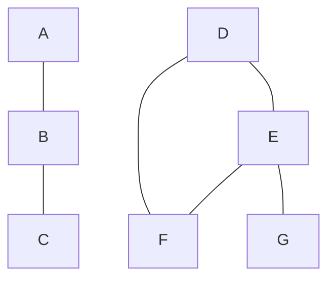

## Macros

### [enforce_graph_structure](macros/enforce_graph_structure.sql)
Readme is TODO

### [connect_ordered_graph](macros/connect_ordered_graph.sql)

Arguments:
- input: the input node (inputted as `ref(...)` or `source(...)`) or CTE (inputted as a string)
- edge_id [text]: the name of the field for the edge_id column in the given table graph representation.
- vertex_1 [Any]: the name of the field for the vertex_1 column in the given table graph representation.
- vertex_2 [Any]: the name of the field for the vertex_2 column in the given table graph representation.
- ordering [Dict[text,text]]: the field (and data type) corresponding to the ordering of the given edges. For example, {'timestamp_field': 'timestamp'} corresponds to a field named `timestamp_field` of type `timestamp` being the ordering field. Data types must be one of: 'timestamp', 'date', 'numeric'.
- graph_id [Optional, text]: the name of the field for the graph_id column in the given table graph representation.

**Usage:**
```sql
with connect_subgraphs as (
    {{ dbt_graph_theory.connect_ordered_graph(
        input=ref('example_model'),
        edge_id='edge_id_field_name',
        vertex_1='vertex_1_field_name',
        vertex_2='vertex_2_field_name',
        ordering={'ordering_field': 'numeric'},
        graph_id='graph_id_field_name'
    ) }}
)
...
```

```sql
...
with connect_subgraphs as (
    {{ dbt_graph_theory.connect_ordered_graph(
        input=ref('example_model'),
        edge_id='edge_id_field_name',
        vertex_1='vertex_1_field_name',
        vertex_2='vertex_2_field_name',
        ordering={'different_ordering_field': 'timestamp'}
    }}
)
...
```

This connects disconnected subgraphs (at the graph_id level) based on a ranking of orderings. This can only be applied on **ordered** graphs, meaning that an `ordering` must be provided via the `ordering` kwarg.

In the below graph (the text on arrows is the ordering - in this case, numeric):

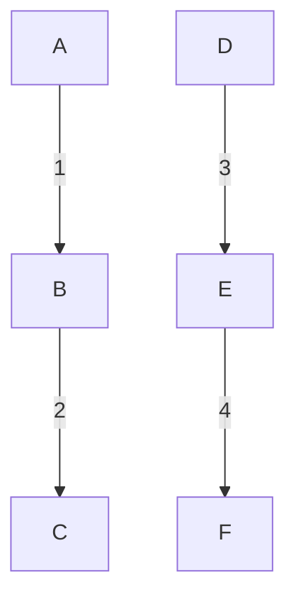

The following graph (in table representation) is returned:

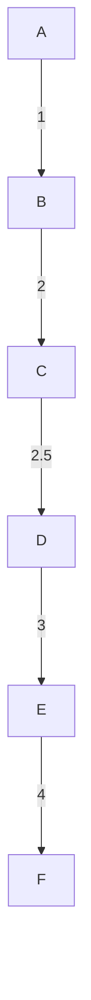

The table in this case will have a new row in the output: 

| graph_id |     edge_id     | vertex_2 | vertex_1 | ordering_field |
|:--------:|:---------------:|:--------:|:--------:|:--------------:|
|     1    | inserted_edge_1 |     C    |     D    |       2.5      |

The orderings of inserted edges are dependent on the data type in question.

Timestamps will be 1 second behind the later edge that is being connected to. For example:

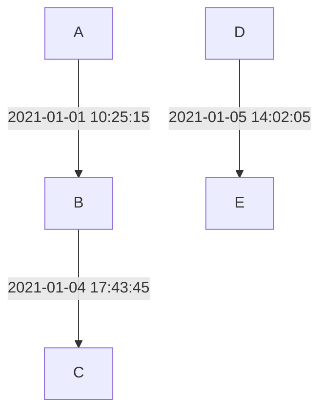

would become

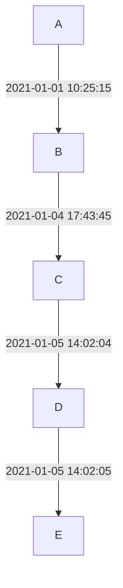

Dates will be 1 day behind the later edge (if this does not conflict with the earlier edge, in which case the date is left equal):

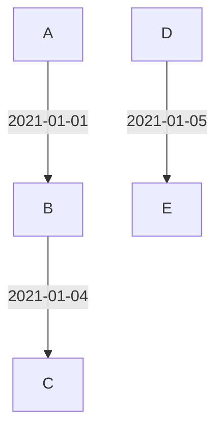

would become


and

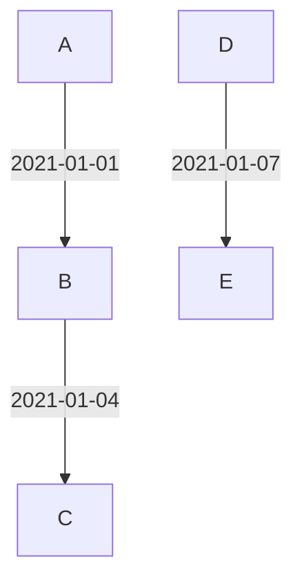

would become

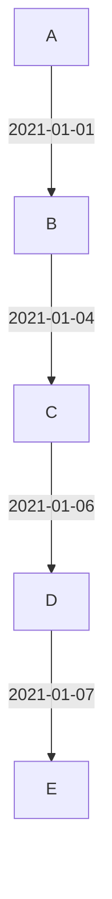

Numerics go exactly in between the two nodes being connected, as demonstrated in the above example.


### [largest_connected_subgraphs](macros/largest_connected_subgraphs.sql)

Arguments:
- input: the input node (inputted as `ref(...)` or `source(...)`) or CTE (inputted as a string)
- edge_id [text]: the name of the field for the edge_id column in the given table graph representation.
- vertex_1 [Any]: the name of the field for the vertex_1 column in the given table graph representation.
- vertex_2 [Any]: the name of the field for the vertex_2 column in the given table graph representation.
- graph_id [Optional, text]: the name of the field for the graph_id column in the given table graph representation.

**Usage:**
```sql
with subgraphs as (
    {{ dbt_graph_theory.largest_connected_subgraphs(
        input=ref('example_model'),
        edge_id='edge_id_field_name',
        vertex_1='vertex_1_field_name',
        vertex_2='vertex_2_field_name',
        graph_id='graph_id_field_name'
    ) }}
)
...
```

```sql
...
subgraphs as (
    {{ dbt_graph_theory.largest_connected_subgraphs(
        input='example_cte',
        edge_id='different_edge_id_field_name',
        vertex_1='different_vertex_1_field_name',
        vertex_2='different_vertex_2_field_name'
    ) }}
)
...
```

This macro groups vertices into the largest connected subgraph that they are a member of.

In the below graph:


The following table is returned:

|  vertex  | subgraph_id |  subgraph_members  |
|:--------:|:-----------:|:------------------:|
|     A    |      1      |  ['A', 'B', 'C']   |
|     B    |      1      |  ['A', 'B', 'C']   |
|     C    |      2      |  ['A', 'B', 'C']   |
|     D    |      2      |['D', 'E', 'F', 'G']|
|     E    |      2      |['D', 'E', 'F', 'G']|
|     F    |      2      |['D', 'E', 'F', 'G']|
|     G    |      2      |['D', 'E', 'F', 'G']|

subgraph_id is designed to be unique to both the graph and subgraph level. When graph_id is defined, the output is also at a graph_id level.

## Helper Macros
Note that the below are designed for internal (ie. dbt-graph-theory) use only. Use them at your own risk!
### [array_agg](macros/utils/array_agg.sql)

Arguments:

- field [text]: the field to be aggregated into an array (inputted as `'field_name'`).
- distinct [optional, bool]: whether the aggregation should only include distinct values (inputted as `true/false`). Defaults to `false`.
- order_field [optional, text]: the field that the array elements should be ordered by (inputted as `'field_name'`). Defaults to `none`.
- order [optional, text]: the ordering that the order_field should be ordered by (inputted as `'field_name'`). Defaults to `none`.

This is an adapter specific macro for aggregating a column into an array.

This macro excludes nulls.

**Usage:**
```sql
select
    date_month,
    {{ dbt_graph_theory.array_agg(field='customer_id') }} as customer_array
from {{ ref('model') }}
group by date_month
```

```sql
select
    date_month,
    {{ dbt_graph_theory.array_agg(field='customer_id', distinct=true, order_field='num_orders') }} as customer_array
from {{ ref('model') }}
group by date_month
```

### [array_append](macros/utils/array_append.sql)

Arguments:

- array [text]: the array field where new values should be appended into (inputted as `'field_name'`).
- new_value [text]: the field (or value) to be appended to the existing array(inputted as `'field_name'` or `'value'`).

This is an adapter specific macro for appending a new value into an array.

**Usage:**
```sql
select
    {{ dbt_graph_theory.array_append('existing_array', 'new_field_to_append') }} as updated_existing_array
from {{ ref('model') }}
```

```sql
select
    {{ dbt_graph_theory.array_append('existing_array', "'a_hardcoded_string'") }} as updated_existing_array
from {{ ref('model') }}
```

### [array_construct](macros/utils/array_construct.sql)

Arguments:

- components [list[text]]: the jinja list which will be used (in order) for the array's construction.

This is an adapter specific macro for constructuring an array from a list of values.

**Usage:**
```sql

select
    {{ dbt_graph_theory.array_construct(components=list) }} as constructed_array
from {{ ref('model') }}
```

```sql
select
    {{ dbt_graph_theory.array_construct(components=['1', 'a_field']) }} as constructed_array
from {{ ref('model') }}
```

### [array_contains](macros/utils/array_contains.sql)

Arguments:

- array [text]: the array field which will be checked for inclusion of the given value.
- value [text]: the field (or hardcoded data) which is checked for in the given array.

This is an adapter specific macro to test whether a value is contained within an array.

**Usage:**
```sql
select
    {{ dbt_graph_theory.array_contains(array='array_field', value='other_value') }} as value_contained__bool
from {{ ref('model') }}
```

**Note**: README structure inspired by dbt-lab's [dbt-utils](https://github.com/dbt-labs/dbt-utils) and calogica's [dbt-date](https://github.com/calogica/dbt-date) and [dbt-expectations](https://github.com/calogica/dbt-expectations).

## Exceptions
These macros are for internal package use only. They should help with raising consistend error messages.
### [adapter_missing_exception](macros/exceptions/adapter_missing_exception.sql)

Arguments: `none`

Raise an exception to highlight that the given adapter is not currently supported.

**Usage:**
```sql
...
{{ dbt_graph_theory.adapter_missing_exception() }}
...
```
